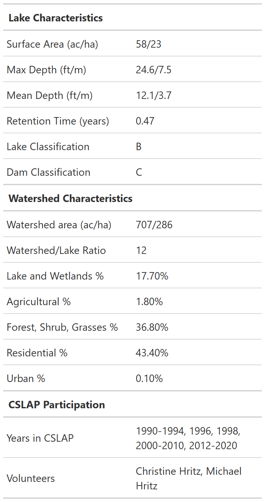
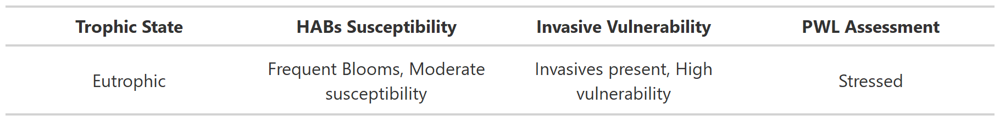

```{r header-creation, echo=FALSE, message=FALSE, warning=FALSE}

watershed_info <- read.csv(file = "C:/Users/amtweitm/OneDrive - New York State Office of Information Technology Services/Documents/R/CSLAP_reporting/data/watershed_info.csv") %>% 
  rename(Lake_ID = 1) %>% 
  filter(Lake_ID == ids)


lake_info <- read.csv(file = "C:/Users/amtweitm/OneDrive - New York State Office of Information Technology Services/Documents/R/CSLAP_reporting/data/lake_info.csv") %>% 
  rename(Lake_ID = 1) %>% 
  filter(Lake_ID == ids)

if(multisite_var == 1){
  lake_info <- lake_info %>% 
  filter(Location_ID == loc_id)
}


lake_watershed_info <- left_join(lake_info, watershed_info, by = c("Lake_ID" = "Lake_ID", "Location_ID" = "Location_ID"))


if(nrow(lake_watershed_info)>0){
table_1 <- lake_watershed_info %>% 
  select(LakeName, Lake.Assn.Name, Town, County) %>% 
  mutate(Full_Town = paste("Town(s) of", Town, sep=" ")) %>% 
  mutate(Full_County = paste(County, "County", sep = " ")) %>% 
  gt() %>% 
    cols_width(
    "LakeName" ~ px(300),
    "Full_Town" ~ px(200),
    "Full_County" ~ px(200),
    "Lake.Assn.Name" ~ px(200)
  ) %>% 
  cols_hide(
    columns = c(
      "Town", "County"
    ) 
  ) %>% 
    tab_options(
    column_labels.hidden = TRUE) %>% 
    tab_style(
    style = cell_text(size = pct(250)),
    locations = cells_body(columns = 1, rows = 1))
  


table_1
}


```

```{r header-creation-2, echo=FALSE, message=FALSE, warning=FALSE}
image_names <- list.files("C:/Users/amtweitm/OneDrive - New York State Office of Information Technology Services/Documents/R/CSLAP_reporting/images/watershed_images")

lake_image <- str_subset(image_names, ids)

if(length(lake_image) == 0){
  lake_image <- "none.png"
}

full_lake_image <- paste("C:/Users/amtweitm/OneDrive - New York State Office of Information Technology Services/Documents/R/CSLAP_reporting/images/watershed_images/", lake_image, sep = "")

image_code <- knitr::include_graphics(full_lake_image)

chars <- c("Surface Area (ac/ha)", "Max Depth (ft/m)", "Mean Depth (ft/m)", "Retention Time (years)", "Lake Classification", "Dam Classification", "Watershed area (ac/ha)", "Watershed/Lake Ratio", "Lake and Wetlands %", "Agricultural %", "Forest, Shrub, Grasses %", "Residential %", "Urban %", "Years in CSLAP", "Volunteers")
values <- c("0", "0","0","0","0","0","0","0","0","0","0","0","0","0","0")

characteristic_df <- data.frame(chars, values)

characteristic_df$values[1] <- paste(lake_watershed_info$Area..ac.[1],"/",lake_watershed_info$Area..ha.[1], sep="")
characteristic_df$values[2] <- paste(lake_watershed_info$Zmax..ft.[1],"/", lake_watershed_info$Zmax..m.[1], sep="")
characteristic_df$values[3] <- paste(lake_watershed_info$Zmean..ft.[1],"/", lake_watershed_info$Zmean..m.[1], sep="")
characteristic_df$values[4] <- lake_watershed_info$Residence[1]
characteristic_df$values[5] <- lake_watershed_info$Class[1]
characteristic_df$values[6] <- lake_watershed_info$DamClass[1]
characteristic_df$values[7] <- paste(lake_watershed_info$WshedArea..ac.[1], "/", lake_watershed_info$WshedArea..ha.[1], sep="")
characteristic_df$values[8] <- round((lake_watershed_info$WshedArea..ac.[1]/lake_watershed_info$Area..ac.[1]), digits=0)
characteristic_df$values[9] <- lake_watershed_info$Lake.Watershed[1]
characteristic_df$values[10] <- lake_watershed_info$Agriculture[1]
characteristic_df$values[11] <- lake_watershed_info$Forest[1]
characteristic_df$values[12] <- lake_watershed_info$Residential[1]
characteristic_df$values[13] <- lake_watershed_info$Urban[1]
characteristic_df$values[14] <- lake_watershed_info$Sampling.Years[1]
###make this a variable so it doesn't have to be changed every year
characteristic_df$values[15] <- lake_watershed_info$X20.samplers[1]

make_char_table <- characteristic_df %>% 
  gt() %>% 
   tab_options(
    column_labels.hidden = TRUE) %>% 
    tab_row_group("CSLAP Participation", rows = 14:15) %>% 
    tab_row_group("Watershed Characteristics", rows = 7:13) %>% 
  tab_row_group("Lake Characteristics", rows = 1:6) %>% 
  cols_width(
    1 ~ px(200),
    2 ~ px(200)
  ) %>% 
  tab_style(
    style =  cell_text(weight = "bold"),
    locations = cells_row_groups()
  ) %>% 
  gtsave("temp_gt.png")

```

{width="500"}{width="400"}

```{r header-creation-3, echo=FALSE, message=FALSE, warning=FALSE}
troph_state <- "0"
habs_suscept <- "0"
inv_vuln <- "0"
pwl_assess <- "0"

assess_df <- data.frame(troph_state, habs_suscept, inv_vuln, pwl_assess)

###calculating troph state
trophic_df <- lake1 %>% 
    distinct(SAMPLE_ID, INFO_TYPE, Characteristic.Name, Result.Sample.Fraction, Result.Value, .keep_all = TRUE)

trophic_df$Result.Sample.Fraction <- replace_na(trophic_df$Result.Sample.Fraction, "None")

trophic_df <- trophic_df %>% 
  mutate(FULL_CHARACTERISTIC_NAME = paste(Characteristic.Name, INFO_TYPE, Result.Sample.Fraction, sep=" ")) %>%
  filter(FULL_CHARACTERISTIC_NAME %in% c("DEPTH, SECCHI DISK DEPTH SD None",
                                         "PHOSPHORUS OW T",
                                         "CHLOROPHYLL A OW T"
                                         ))

for(i in 1:nrow(trophic_df)){
  if(trophic_df$SAMPLE_DATE[i] >= as.Date(paste(year(trophic_df$SAMPLE_DATE[i]), 07, 15, sep = "-")) & trophic_df$SAMPLE_DATE[i] <= as.Date(paste(year(trophic_df$SAMPLE_DATE[i]), 09, 15, sep = "-"))){
    trophic_df$season[i] <- "productivity"
  } else if(trophic_df$SAMPLE_DATE[i] >= as.Date(paste(year(trophic_df$SAMPLE_DATE[i]), 06, 1, sep = "-")) & trophic_df$SAMPLE_DATE[i] <= as.Date(paste(year(trophic_df$SAMPLE_DATE[i]), 07, 14, sep = "-"))){
    trophic_df$season[i] <- "summer"
  } else if(trophic_df$SAMPLE_DATE[i] >= as.Date(paste(year(trophic_df$SAMPLE_DATE[i]), 09, 15, sep = "-")) & trophic_df$SAMPLE_DATE[i] <= as.Date(paste(year(trophic_df$SAMPLE_DATE[i]), 10, 1, sep = "-"))){
    trophic_df$season[i] <- "summer"
  } else {
   trophic_df$season[i] <- "not"
  }
}

trophic_df$Result.Value <- as.numeric(trophic_df$Result.Value)

trophic_df <- trophic_df %>% 
  filter(season != "not") %>% 
  filter(!is.na(Result.Value)) %>% 
  group_by(FULL_CHARACTERISTIC_NAME, year, season) %>% 
  dplyr::summarize(avg_result_s = mean(Result.Value)) %>% 
  ungroup() %>% 
  group_by(FULL_CHARACTERISTIC_NAME) %>%
  dplyr::summarize(avg_result = mean(avg_result_s))

secchi <- trophic_df$avg_result[trophic_df$FULL_CHARACTERISTIC_NAME == "DEPTH, SECCHI DISK DEPTH SD None"] 

if(is.na(secchi)){
  secchi_score <- "0"
  secchi_reason <- "unsampled"
} else if(secchi >5){
  secchi_score <- 3
  secchi_reason <- "high"
} else if(secchi <2){
  secchi_score <- 1
  secchi_reason <- "low"
} else{
  secchi_score <- 2
  secchi_reason <- "moderate"
}

tphos <- trophic_df$avg_result[trophic_df$FULL_CHARACTERISTIC_NAME == "PHOSPHORUS OW T"]

if(is.na(tphos)){
  tphos_score <- "0"
  tphos_reason <- "unsampled"
} else if(tphos > 0.02){
  tphos_score <- 1
  tphos_reason <- "high"
} else if(tphos < 0.01){
  tphos_score <- 3
  tphos_reason <- "low"
} else{
  tphos_score <- 2
  tphos_reason <- "moderate"
}


chla <- trophic_df$avg_result[trophic_df$FULL_CHARACTERISTIC_NAME == "CHLOROPHYLL A OW T"]

if(is.na(chla)){
  chla_score <- "0"
  chla_reason <- "unsampled"
} else if(chla > 8){
  chla_score <- 1
  chla_reason <- "high"
} else if(chla < 2){
  chla_score <- 3
  chla_reason <- "low"
} else{
  chla_score <- 2
  chla_reason <- "moderate"
}


trophic_sum <- secchi_score + tphos_score + chla_score


if(trophic_sum == 3){
  overall_trophic_state <- "Eutrophic"
  ts_descriptor <- "highly productive"
} else if(trophic_sum == 9){
  overall_trophic_state <- "Oligotrophic"
  ts_descriptor <- "moderately to highly productive"
} else if(trophic_sum == 6){
  overall_trophic_state <- "Mesotrophic"
  ts_descriptor <- "moderately productive"
} else if(trophic_sum %in% c(4,5)){
  overall_trophic_state <- "Mesoeutrophic"
  ts_descriptor <- "moderately unproductive"
} else if(trophic_sum %in% c(7,8)){
  overall_trophic_state <- "Mesoligotrophic"
  ts_descriptor <- "unproductive"
}

assess_df$troph_state[1] <- overall_trophic_state

###Calculating invasive vuln
if(lake_info$Invasive.Animals.[1] %in% c(NA, "none reported", "")){
  inv_animals <- 0
} else{inv_animals <- 1}

if(inv_animals == 1){
 lake_info$Invasive.Animals.[1] <- str_replace_all(lake_info$Invasive.Animals.[1], ";", ",")
}

if(lake_info$Invasive.Plants.[1] %in% c(NA, "none reported", "")){
  inv_plants <- 0
} else{inv_plants <- 1}

if(inv_plants == 1){
  lake_info$Invasive.Plants.[1] <- str_replace_all(lake_info$Invasive.Plants.[1], ";", ",")
}

invasives <- inv_animals + inv_plants

if(invasives == 0){
  invasives_present <- "No invasives present, "
} else if(invasives > 0){
  invasives_present <- "Invasives present, "
  }

calcium <- lake1 %>% 
  filter(Characteristic.Name == "CALCIUM") %>% 
  filter(!is.na(Result.Value)) %>% 
  group_by(Characteristic.Name, year) %>% 
  summarize(avg_calc = median(as.numeric(Result.Value))) %>% 
  ungroup() %>% 
  group_by(Characteristic.Name) %>% 
  summarize(Longterm_Avg = median(avg_calc))

  

if(invasives > 0){
 inv_vulnerability <- "High vulnerability" 
} else if(is.na(calcium$Longterm_Avg[1])){
  inv_vulnerability <- "Unknown vulnerability"
} else if(calcium$Longterm_Avg[1] > 30){
  inv_vulnerability <- "High vulnerability"
} else if(calcium$Longterm_Avg[1] >= 15 & calcium$Longterm_Avg[1] <= 30){
  inv_vulnerability <- "Moderate vulnerability"
} else if(calcium$Longterm_Avg[1] < 15){
  inv_vulnerability <- "Low vulnerability"
  }

assess_df$inv_vuln <- paste(invasives_present, inv_vulnerability, sep="")

lake_watershed_info <- lake_watershed_info %>% 
  replace_na(list(PotableWater.PWL = "Not Applicable",
                  Bathing..PWL = "Not Applicable",
                  Recreation.PWL = "Not Applicable",
                  AquaticLife.PWL = "Not Applicable",
                  FishConsumption.PWL = "Not Applicable"))

if(lake_watershed_info$PotableWater.PWL[1] == "Impaired" |
   lake_watershed_info$Bathing..PWL[1] == "Impaired" |
   lake_watershed_info$Recreation.PWL[1] == "Impaired" |
   lake_watershed_info$AquaticLife.PWL[1] == "Impaired" |
   lake_watershed_info$FishConsumption.PWL[1] == "Impaired"){
          assess_df$pwl_assess[1] <- "Impaired"
} else if(lake_watershed_info$PotableWater.PWL[1] == "Stressed" |
   lake_watershed_info$Bathing..PWL[1] == "Stressed" |
   lake_watershed_info$Recreation.PWL[1] == "Stressed" |
   lake_watershed_info$AquaticLife.PWL[1] == "Stressed" |
   lake_watershed_info$FishConsumption.PWL[1] == "Stressed"){
          assess_df$pwl_assess[1] <- "Stressed"
} else if(lake_watershed_info$PotableWater.PWL[1] == "Threatened" |
   lake_watershed_info$Bathing..PWL[1] == "Threatened" |
   lake_watershed_info$Recreation.PWL[1] == "Threatened" |
   lake_watershed_info$AquaticLife.PWL[1] == "Threatened" |
   lake_watershed_info$FishConsumption.PWL[1] == "Threatened"){
          assess_df$pwl_assess[1] <- "Threatened"
} else if(lake_watershed_info$PotableWater.PWL[1] == "Fully Supported" |
   lake_watershed_info$Bathing..PWL[1] == "Fully Supported" |
   lake_watershed_info$Recreation.PWL[1] == "Fully Supported" |
   lake_watershed_info$AquaticLife.PWL[1] == "Fully Supported" |
   lake_watershed_info$FishConsumption.PWL[1] == "Fully Supported"){
          assess_df$pwl_assess[1] <- "Fully Supported"
} else{
          assess_df$pwl_assess[1] <- "Unassessed"
}

###HABS
if(chla > 20){
  habs_susceptibility <-  "High susceptibility"
} else if(tphos > 0.02){
  habs_susceptibility <-  "Moderate susceptibility"
} else if(chla > 10){
  habs_susceptibility <-  "Moderate susceptibility"
} else{
  habs_susceptibility <-  "Low susceptibility"
}

listing_df<-lake1 %>% 
  filter(STATUS%in%c("CONFIRMED","CONFIRMED WITH HIGH TOXINS")) %>% 
  mutate(STATUS_CODE=as.factor(STATUS)) %>% 
  mutate(STATUS_CODE=recode(STATUS_CODE,"NO BLOOM"=0,"SUSPICIOUS"=1,"CONFIRMED"=2,"CONFIRMED WITH HIGH TOXINS"=3)) %>%
  mutate(STATUS_CODE=as.numeric(STATUS_CODE)) %>% 
  dplyr::summarise(Number_of_Reports =n()) %>% 
    ungroup()

if(listing_df[1] == 0){
  bloom_reports <- "No Reported Blooms"
} else if(listing_df[1] > 2){
  bloom_reports <- "Frequent Blooms"
} else{
  bloom_reports <- "Periodic Blooms"
}

assess_df$habs_suscept[1] <- paste0(bloom_reports, ", ", habs_susceptibility)

##Make table
make_assess_table <- assess_df %>% 
  gt() %>% 
  cols_label(troph_state = md("**Trophic State**"),
             habs_suscept = md("**HABs Susceptibility**"),
             inv_vuln = md("**Invasive Vulnerability**"),
             pwl_assess = md("**PWL Assessment**")) %>% 
  cols_width(
    "troph_state" ~ px(225),
    "habs_suscept" ~ px(225),
    "inv_vuln" ~ px(225),
    "pwl_assess" ~ px(225)) %>% 
  cols_align(
  align = "center",
  columns = everything()
  ) %>% 
  gtsave("temp_gt2.png")

```


